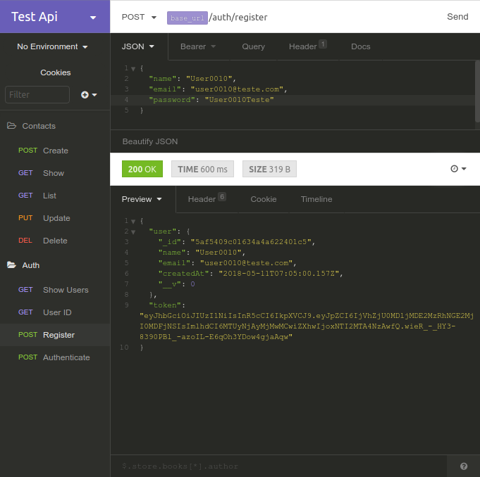
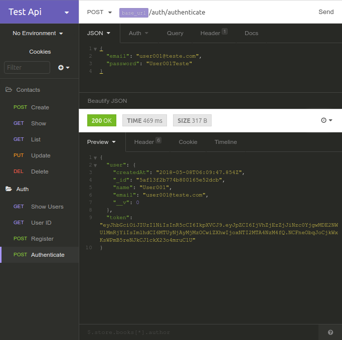
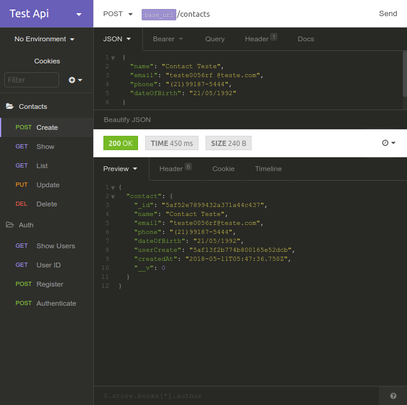
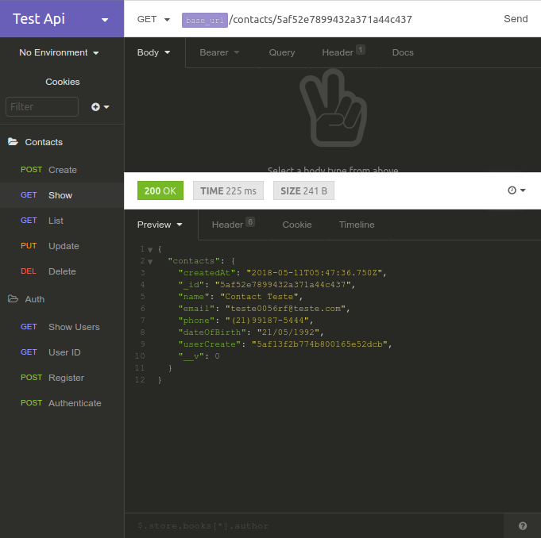

# 
 Contatos-API 

API com CRUD de contatos para consumo no FRONT-END.

Com implementação de POST, GET, PUT e DELETE de contatados com autenticação de usuário e validação de token.

Siga o guia para clone.
1. `git clone https://github.com/JeffersonLG/contatos-API.git`
2. `cd contatos-API`
3. `npm install`
4. `npm run dev` ou `npm run start`
5. API on-line na URL: `http://localhost:3001`

Requisitos minimos:
Node: `v8.11.1`
NPM: `v6.0.1`

## Capturas de testes.
`Captura de tela de cadastro de User, com seu respectivel token.`

`Captura de tela de Autenticação de um usuário, na autenticação é gerado um token unico com tempo de validade.`

`Capitura de tela de um cadastro de Contato com o ID do usuário criador.`

`Captura de tela de uma busca de Contato por ID.`

